# Exploring global temperatures since 1750 

## 1. Scatter plot

### a) first plot all AverageTemperatureCelsius vs. year

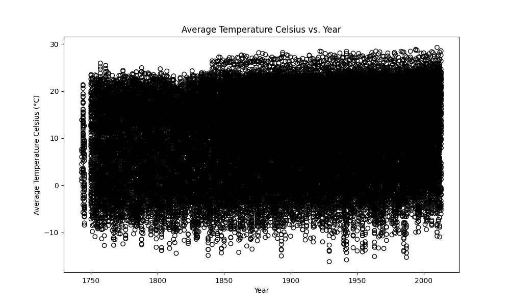

### b) recreate the plot using 'points' instead 'circles', add grid

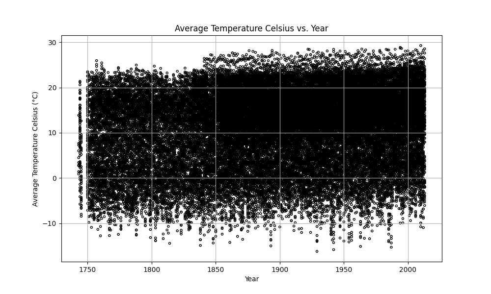

### c) add transparency

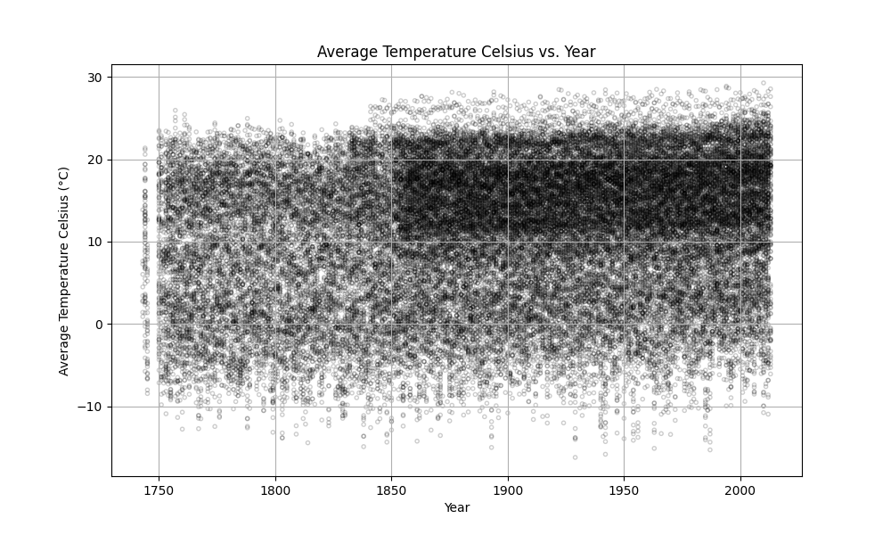

### d) add color

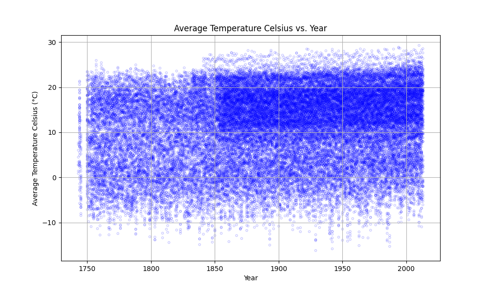

## 2. Box plots

### a) visualising the distribution of temperatures within each country

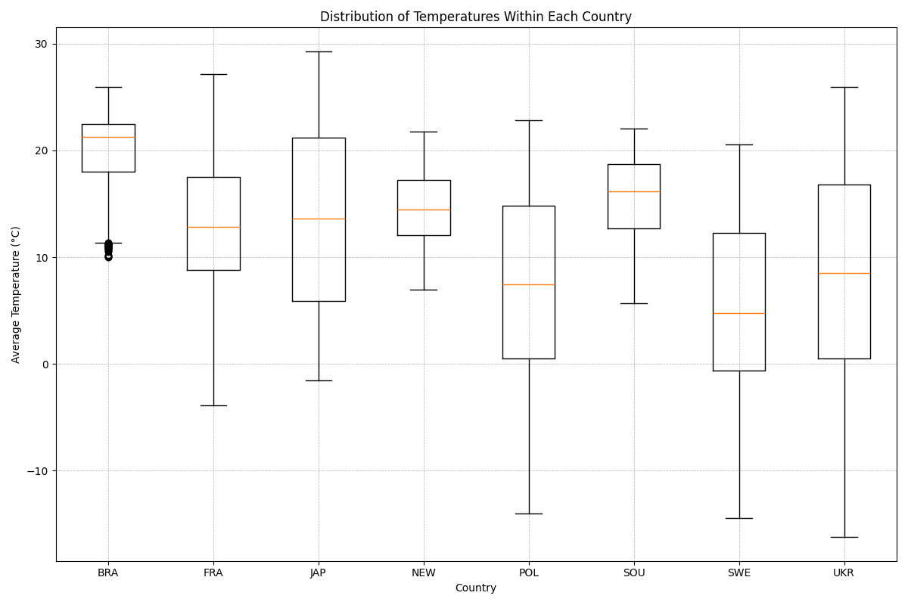

### b) add jitter to boxplot

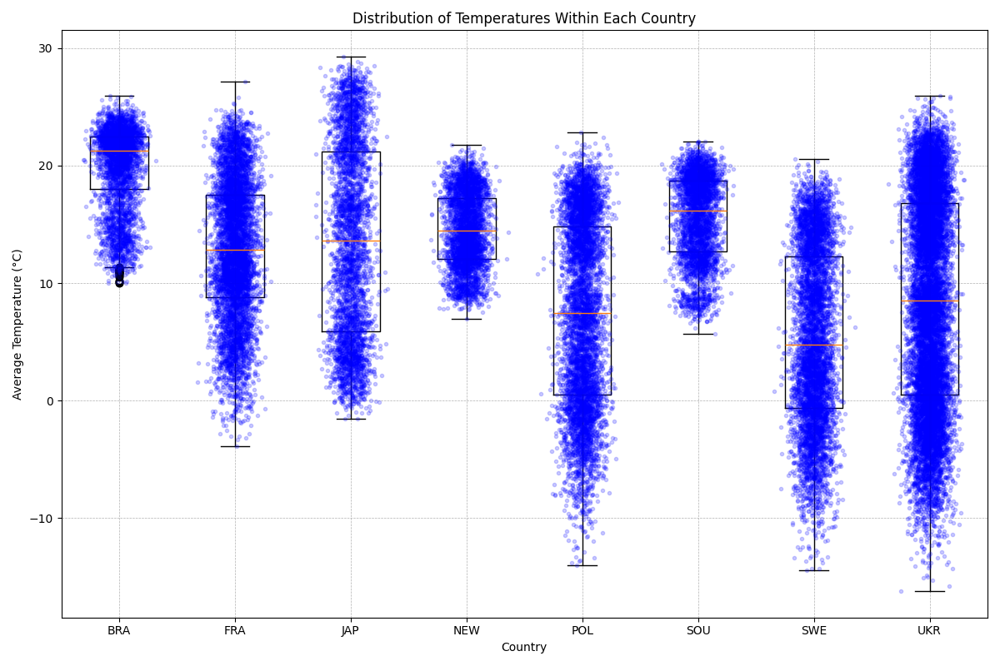

### c) change boxplot to violin plot (sometimes known as a beanplot)

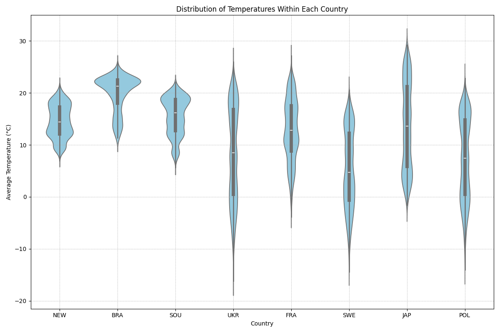

## 3. Time series

### a) calculate average temperature per year per each country 

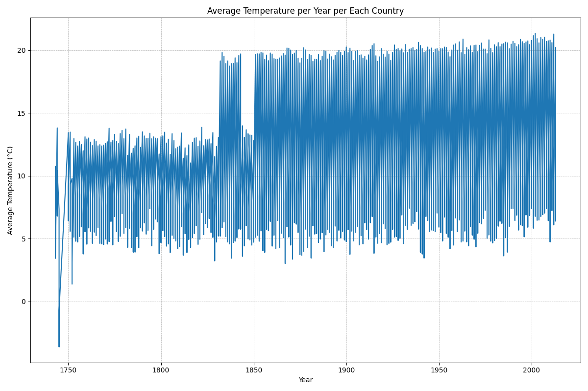

### b) to avoid too much of information split graphed data by Country

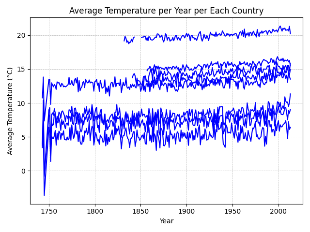

### c) and add color

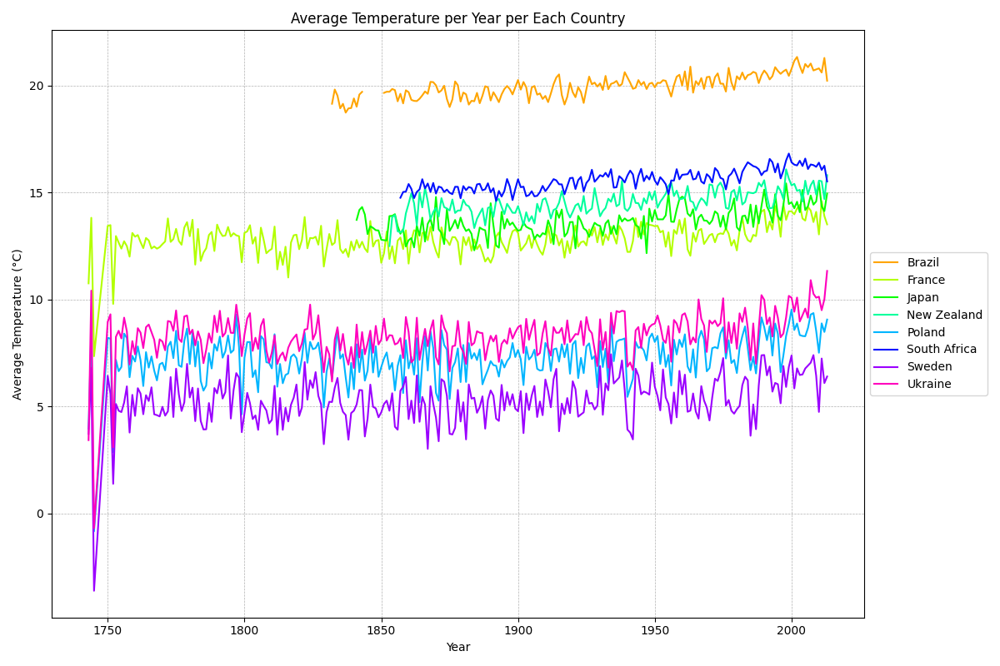

## 4. Grouping multiple subplots

### a) make one (!) plot containing multiple subplots

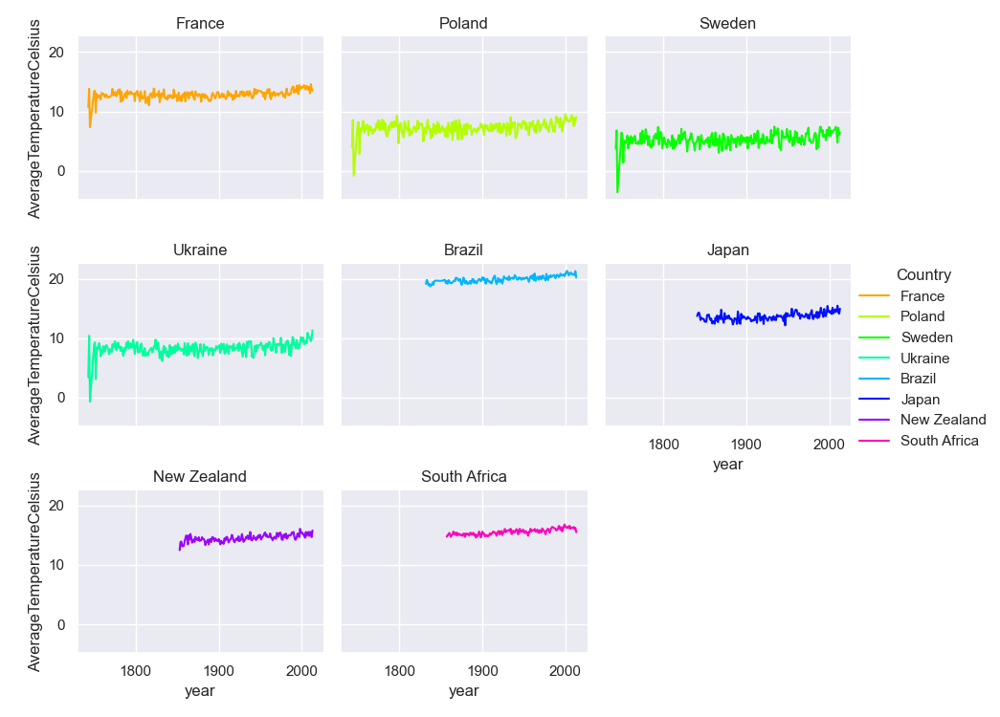

### b) split line in each subplot by city of each country

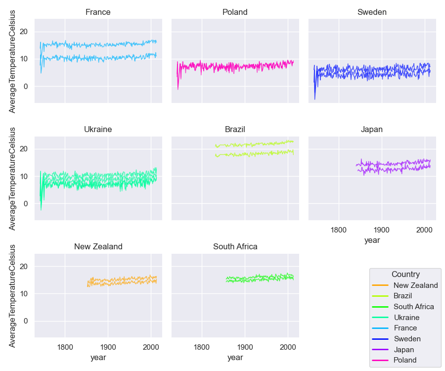

### c) clean background

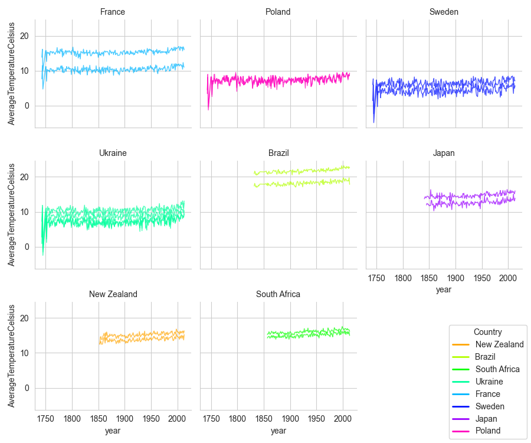

### d) divide into cities

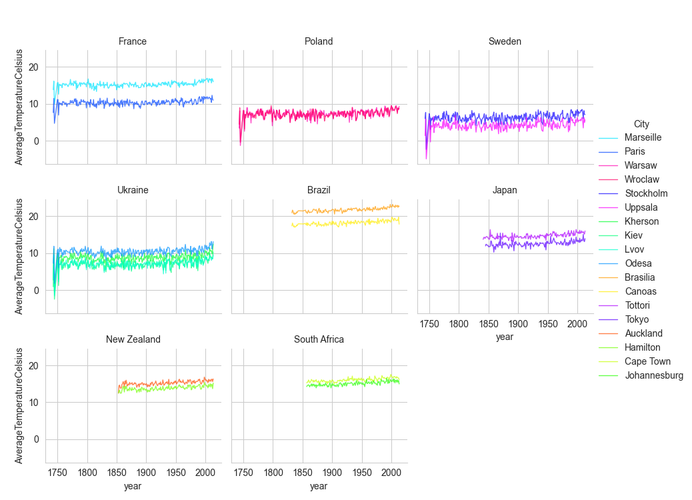

### e) change labels, add title, customize fonts, rotate elements, etc.

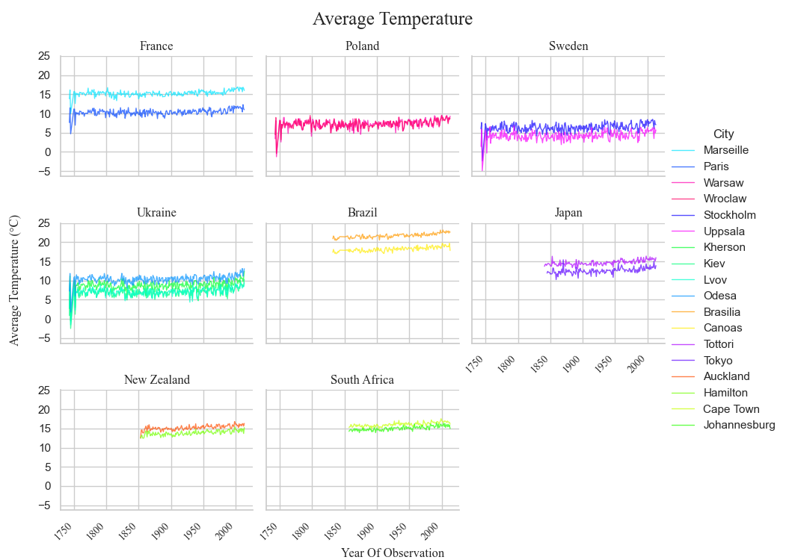
